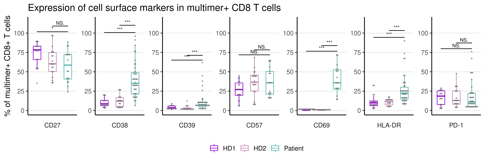
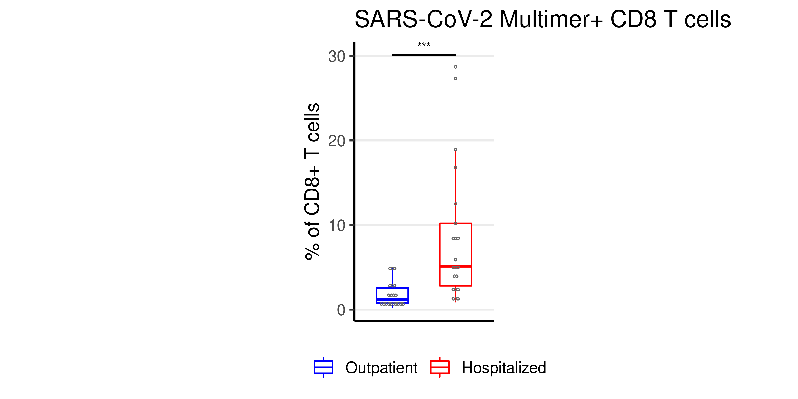

```{r setup, include=FALSE}
knitr::opts_chunk$set(echo = FALSE)
library("tidyverse")
library("ggpubr")
library("knitr")
library("readxl")
```

## OVERVIEW
* Introduction
* Materials - Dataset
* Method
* Results
* Discussion
---

## Introduction
* SARS-CoV-2 virus is responsible of the current COVID-19 pandemia, causing the death of more 3.2 million people worldwide.  
* Studies in convalescent patients has shown a decline of antibody-mediated response a few months after infection. 
* CD8+ T cells are critical for efficient clearance of virus-infected cells and long-term protection against SARS-CoV-2.
* DTU HealthTech Department analyzed T cell recognition towards SARS-CoV-2-derived peptides in COVID-19 patients and HD using DNA-barcoded pMHC multimers combined with a T cell phenotype panel. 

## Objective
* The project utilizes flow cytometry data published by Saini et al., 2021, to make a T cell phenotype analysis by comparing the expression of cell surface markers in COVID-19 patients and healthy individuals to better understand T cell immunity to SARS-CoV-2 infection.
```{r, echo=FALSE, warning=FALSE, out.width = "700px", fig.align='center', fig.cap="Fig. 1-Experimental pipeline for T cell identification from COVID-19 patients."}
include_graphics("../images/Pipeline-1.png")
```
---
## Materials and methods

### <b>
### Data analysis software
### </b>
* Rstudio software was used to tidy and transform the flow cytometry raw data and to generate graphs to perform T cell phenotype analysis. 
* Tidyverse package:

*readxl - import spreadsheets

*dplyr - manipulate data

*ggplot2 - data visualization

## Raw dataset
* Raw data published by Saini et al., 2021 obtained from flowcytometry analysis.
* Dataset 1: Raw data (.xlsx) extracted from .fcs files after cell gating using FlowJo data analysis software.
* Dataset 2: Raw data (.fcs) obtained from flow cytometry for 3 representative samples for UMAP analysis 

```{r, echo=FALSE, warning=FALSE, message=FALSE}
covid_data_raw <- read_excel("../data/_raw/covid_data.xlsx")
write_tsv(x = covid_data_raw,
          file = "../data/01_covid_data.tsv")
covid_data <- read_tsv(file = "../data/01_covid_data.tsv")
```


## COVID-19 raw dataset {.smaller}
```{r}
covid_data_raw
```

## Data wrangling 

* Performed to transform the data into a format which can be plotted. 
* Remove NA
* Add cohort names as columns using mutate
* Consolidate the markers on sampleID using pivot longer
* Splitting the gating path into two columns - Last and parent population

```{r, wrangle data, echo=FALSE, warning=FALSE, message=FALSE}
covid_data_clean <- covid_data %>% 
  na_if("NA") %>% 
  mutate_if(is.numeric, round, digits=1)

covid_data_clean <- covid_data %>% 
  mutate(cohort_type = case_when( str_detect(SampleID, "Patient") ~ "Patient",
                                  str_detect(SampleID, "HD-1") ~ "HD-1",
                                  str_detect(SampleID, "HD-2") ~"HD-2"),
         .after = SampleID,
         cohort_type = factor(cohort_type, 
                              levels = c("Patient", "HD-1", "HD-2"))
         )
write_tsv(x = covid_data_clean,
          file = "../data/02_covid_data_clean.tsv")
```

## COVID-19 clean dataset
```{r}
covid_data_clean
```

## Data Augmenting {.smaller}

* Pivot_longer to 
* Mutate

```{r, augment, echo=FALSE, warning=FALSE, message=FALSE}
covid_data_clean <- read_tsv(file = "../data/02_covid_data_clean.tsv")
covid_data_augment <- covid_data_clean %>% 
  pivot_longer(cols = contains("lymphocytes"),
               names_to = "Gating",
               values_to = "Fraction") %>% 
  mutate(T_cell = case_when(str_detect(Gating, "CD8") ~ "CD8",
                            str_detect(Gating, "CD4") ~ "CD4"),
         Parent_population = str_match(Gating, "\\S+\\/(\\S+)\\/\\S+$")[,2],
         Last_population = str_match(Gating, "\\S+\\/(\\S+)$")[,2],
         .before = Fraction)
write_tsv(x = covid_data_augment,
          file = "../data/03_covid_data_augment.tsv")
```


* COVID-19 augmented dataset
```{r}
covid_data_augment
```

## Results {.smaller}

```{r, echo=FALSE, results='hide'}
text_size <- 14
dot_size <- 0.3
dot_color <- "#696969"

boxplot_width <- 0.5

boxplot_color_CEF <- "#d8b365" 
boxplot_color_SARS_pt <- "#5ab4ac"
boxplot_color_SARS_HD1 <- "#9400D3"
boxplot_color_SARS_HD2 <- "#BF87B3"
boxplot_color_SARS_Outpt <- "blue"
boxplot_color_SARS_Hosp <- "red"

sig_vjust <- -0.1
sig_textsize <- 3
sig_color <- "black"
sig_tip_length <- 0

```


```{r, echo=TRUE, results='hide', size='tiny'}
fig_A <- covid_data_augment %>% 
  filter(str_detect(Parent_population, "SARS"),
         Last_population %in% c("CD27", "CD38", "CD39", "CD57", "CD69", "HLA-DR", "PD-1")) %>% 
  ggplot(aes(x = cohort_type, 
             y = Fraction, 
             color = cohort_type))+
  geom_boxplot(outlier.shape = NA,
               width = boxplot_width)+
  geom_dotplot(binaxis = "y",
               stackdir = "center",
               dotsize = dot_size,
               fill = NA,
               color = dot_color)+
  facet_wrap(vars(Last_population),
             scales = "free_y",
             nrow = 1, 
             strip.position = "bottom")+
  scale_y_continuous(limit = c(0,115),
                     breaks = seq(0,100, 25))+
  scale_color_manual(labels = c("HD1", "HD2", "Patient"),
                     values = c(boxplot_color_SARS_HD1,
                                boxplot_color_SARS_HD2,
                                boxplot_color_SARS_pt))+
  theme_classic(base_size = text_size)+
  theme(legend.position = "bottom",
        legend.title = element_blank(),
        axis.title.x = element_blank(),
        axis.text.x = element_blank(),
        axis.ticks.x=element_blank(),
        panel.grid.major.y = element_line(),
        strip.background = element_rect(colour=NA),
        strip.placement = "outside",
        aspect.ratio = 2)+
  labs(title = "Comparison of the expression of cell surface markers in 
       SARS-CoV-2 pMHC multimer+ CD8+ T cells in the HD and COVID-19 patient cohorts.")+
  geom_signif(comparisons = list(c("HD-1", "Patient"),
                                 c("HD-2", "Patient")),
              method = "kruskal.test",
              map_signif_level = TRUE,
              vjust = sig_vjust,
              textsize = sig_textsize,
              color = sig_color,
              tip_length = sig_tip_length, 
              step_increase = 0.1
              )
```
---

# Figure 1
```{r fig_A, fig_B, echo = FALSE, out.width = "900px", out.height= "300px", fig.align='center'}

```
---

# Figure 2
```{r fig_B, fig_D, , echo = FALSE, out.width = "900px", out.height= "300px", fig.align='center'}
include_graphics("../results/fig_B.png")

```
---


## Conclusion

## Introduction
* The project utilizes data of immuno phenotyping analysis on Covid patient samples (flow cytometry data), which are then plotted to make analysis based on the changes in cell-surface markers expressed when the patient is infected with SARS-Cov2.
* The data used was generated at DTU Healthtech - Department of Experimental and translational immunology.
* It is then proceeded to wrangling of data obtained from analysis of patient samples on the onset of Covid symptoms.
*The wrangled data is then plotted to compare the cell surface markers between different patients to understand the changes of the immune cells during the phase of Covid.
*Here we compare the immune profiles of patients who were hospitalized and throse who were not hospitalized with those of healthy individuals
---
