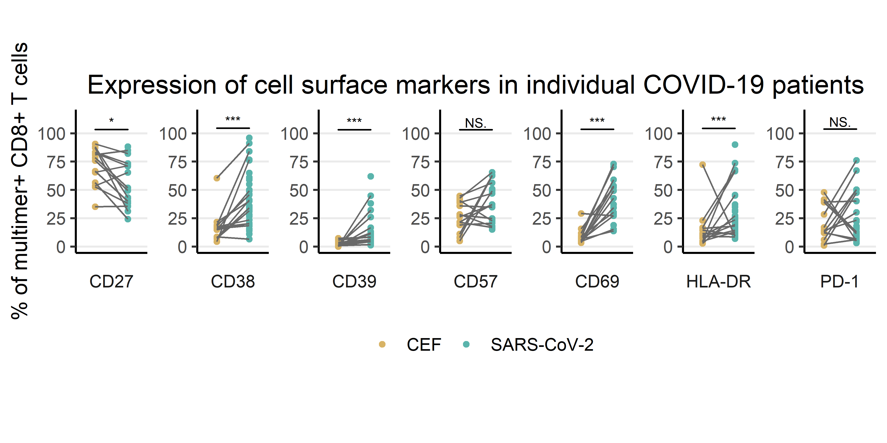
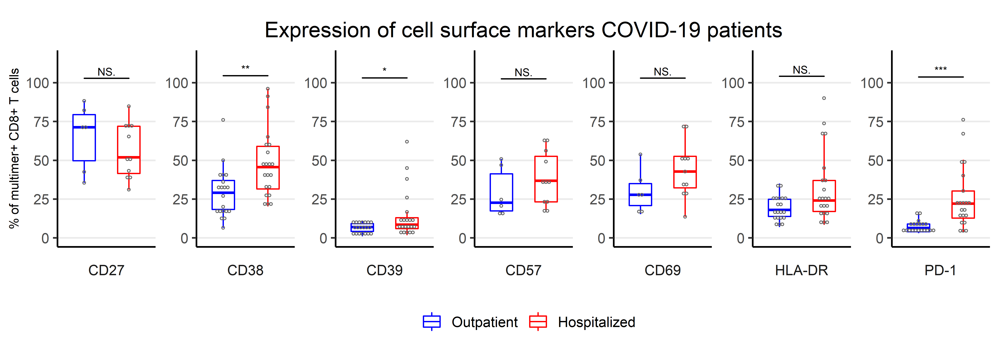

```{r setup, include=FALSE}
knitr::opts_chunk$set(echo = FALSE)
library("tidyverse")
library("ggpubr")
library("knitr")
library("readxl")
```

## OVERVIEW 
* Introduction
* Materials - Dataset
* Method
* Results
* Discussion

## INTRODUCTION
>- The current COVID-19 pandemia, caused by the SARS-CoV-2 virus, has caused the death of more than 3.2 million people worldwide.  
>- Studies in convalescent patients has shown a decline of antibody-mediated response a few months after infection. 
>- CD8+ T cells are critical for efficient clearance of virus-infected cells and long-term protection against SARS-CoV-2.
>- DTU HealthTech Department analyzed T cell recognition towards SARS-CoV-2-derived peptides in COVID-19 patients and healthy individuals using DNA-barcoded pMHC multimers combined with a T cell phenotype panel.

## Objective
* The project utilizes flow cytometry data published by Saini et al., 2021, to make a T cell phenotype analysis by comparing the expression of cell surface markers in COVID-19 patients and healthy individuals to better understand T cell immunity to SARS-CoV-2 infection.

```{r, echo=FALSE, warning=FALSE, out.width = "700px", fig.align='center', fig.cap="Fig. 1-Experimental pipeline for T cell identification from COVID-19 patients."}
include_graphics("../images/Pipeline-1.png")
```


## Materials and methods - Data

>- The dataset (.csv) used in the project is a rawdata extracted from .fcs file format (obtained from flowcytometry analysis)
>- Wrangling of data - Performed to clean data required for plotting


```{r, echo=FALSE, warning=FALSE, message=FALSE}
covid_data_raw <- read_excel("../data/_raw/covid_data.xlsx")
write_tsv(x = covid_data_raw,
          file = "../data/01_covid_data.tsv")
covid_data <- read_tsv(file = "../data/01_covid_data.tsv")
```


## COVID-19 raw dataset {.smaller}
```{r}
covid_data_raw
```


## Data wrangling 

* Remove NA
* Add cohort names as columns using mutate
* Consolidate the markers on sampleID using pivot longer
* Splitting the gating path into two columns - Last and parent population using str_detect

```{r, echo=FALSE, warning=FALSE, message=FALSE}
covid_data_clean <- covid_data %>% 
  na_if("NA") %>% 
  mutate_if(is.numeric, round, digits=1)

covid_data_clean <- covid_data %>% 
  mutate(cohort_type = case_when( str_detect(SampleID, "Patient") ~ "Patient",
                                  str_detect(SampleID, "HD-1") ~ "HD-1",
                                  str_detect(SampleID, "HD-2") ~"HD-2"),
         .after = SampleID,
         cohort_type = factor(cohort_type, 
                              levels = c("Patient", "HD-1", "HD-2"))
         )
write_tsv(x = covid_data_clean,
          file = "../data/02_covid_data_clean.tsv")
```

## Data- Augmenting {.smaller}
```{r, augment, echo=FALSE, warning=FALSE, message=FALSE}
covid_data_clean <- read_tsv(file = "../data/02_covid_data_clean.tsv")
covid_data_augment <- covid_data_clean %>% 
  pivot_longer(cols = contains("lymphocytes"),
               names_to = "Gating",
               values_to = "Fraction") %>% 
  mutate(T_cell = case_when(str_detect(Gating, "CD8") ~ "CD8",
                            str_detect(Gating, "CD4") ~ "CD4"),
         Parent_population = str_match(Gating, "\\S+\\/(\\S+)\\/\\S+$")[,2],
         Last_population = str_match(Gating, "\\S+\\/(\\S+)$")[,2],
         .before = Fraction)
write_tsv(x = covid_data_augment,
          file = "../data/03_covid_data_augment.tsv")
```

```{r}
covid_data_augment
```

## Creating plots
* Reading covid_data_augment
* Filterrig on Parent and Last population
* Generate plot using ggplot - Boxplot and dotplot
* Multiple plots viewed as facetwrap
* Used geomsignif with Kruskal test

# Results

## Figures - A and B
```{r fig_A, fig_B, echo = FALSE, out.width = "900px", out.height= "300px", fig.align='center'}
include_graphics("../results/04_fig_A.png")
include_graphics("../results/04_fig_B.png")
```

## Figures - C and E
```{r fig_C , echo = FALSE, out.width = "900px", out.height= "300px", fig.align='center'}
include_graphics("../results/04_fig_E.png")
include_graphics("../results/04_fig_C.png")
```

## Figures - D and F
```{r fig_D , echo = FALSE, out.width = "900px", out.height= "300px", fig.align='center'}


```

## Figures - S7B and S8C
```{r fig_S7 , echo = FALSE, out.width = "900px", out.height= "300px", fig.align='center'}
include_graphics("../results/04_fig_S7B.png")
include_graphics("../results/04_fig_S8C.png")
```


## DISCUSSION


