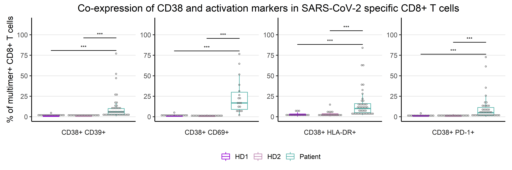
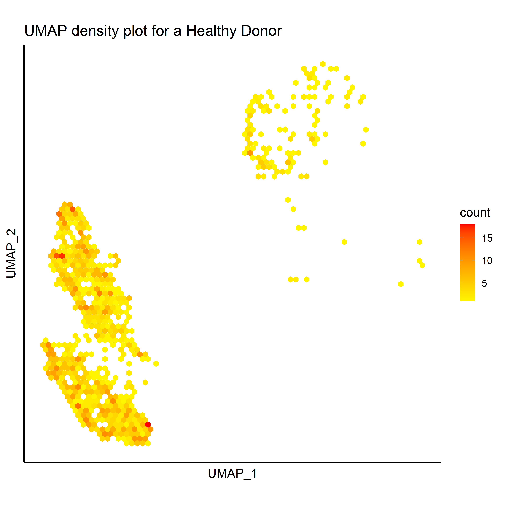
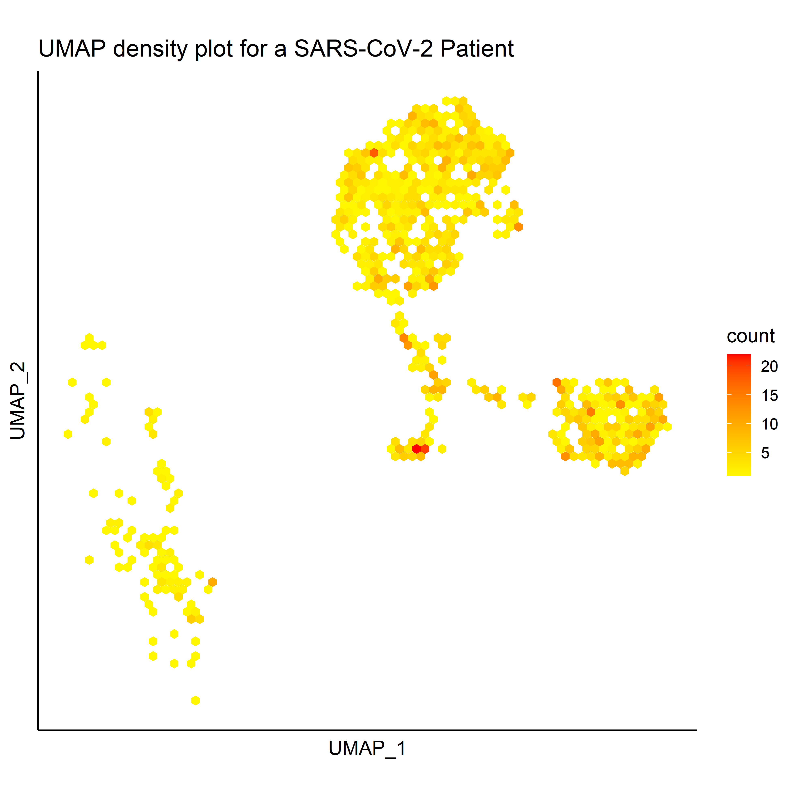
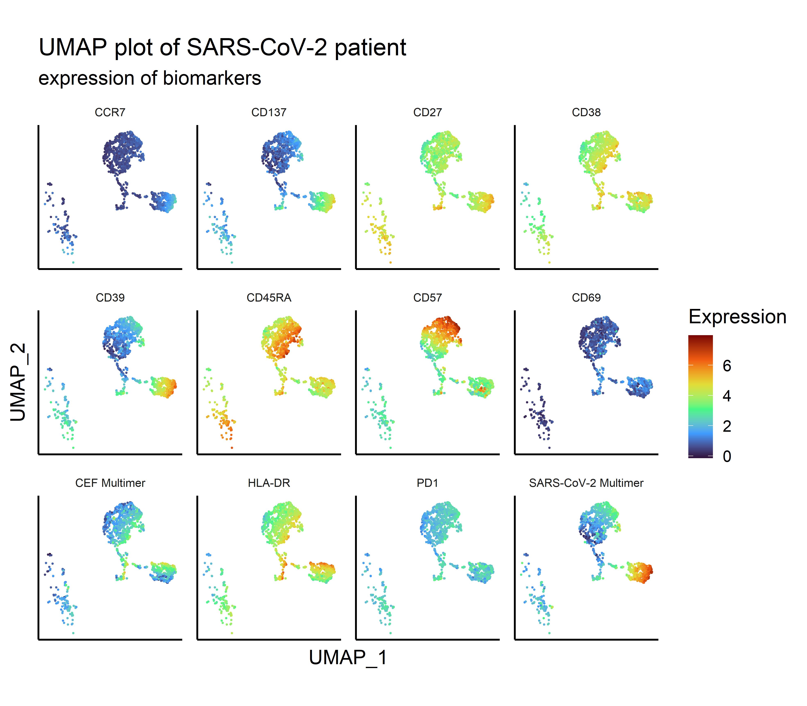

```{r setup, include=FALSE}
knitr::opts_chunk$set(echo = FALSE)
library("tidyverse")
library("ggpubr")
library("knitr")
library("readxl")
```


## Introduction

- The current COVID-19 pandemia, caused by the SARS-CoV-2 virus, has caused the death of more than 3.2 million people worldwide.

- Studies in convalescent patients has shown a decline of antibody-mediated response a few months after infection. 

- CD8+ T cells are critical for efficient clearance of virus-infected cells and long-term protection against SARS-CoV-2.

- Saini *et al* have analyzed T cell recognition towards SARS-CoV-2-derived peptides in COVID-19 patients and healthy individuals using DNA-barcoded pMHC multimers combined with a T cell phenotyping.

## Objective

* In this project, we analyze the immunophenotypes of CD8 T cells that can recognize peptides from the SARS-CoV-2 genome 
* We compare COVID-19 patients with healthy donors (HD) never exposed to the virus.
* Furthermore, we compare the phenotypes to the severity of the disease.
* We also compare the phenotype of the SARS-CoV-2 specific CD8 T cells with T cells that recognize common viruses.

```{r, echo=FALSE, warning=FALSE, out.width = "1000px", fig.align='center', fig.cap="Fig. 1-Experimental pipeline for T cell identification from COVID-19 patients."}

```

## Overview
```{r overview , echo = FALSE, out.width = "900px", fig.align='center'}

```


## Materials and methods

### Phenotype data

- Phenotyping of immune cells provides imformation abouts the activation status of the cells
- This is obtained through antibody staining and flow cytometry, which transforms a fluorescent signal into a voltage.
- Cell populations of specific phenotype is gated in FlowJo software, and frequencies of positive cells can afterwards exported as an .xlsx file


```{r, echo=FALSE, warning=FALSE, message=FALSE}
covid_data_raw <- read_excel("../data/_raw/covid_data.xlsx")
write_tsv(x = covid_data_raw,
          file = "../data/01_covid_data.tsv")
covid_data <- read_tsv(file = "../data/01_covid_data.tsv")
```


## Raw data {.smaller}

* The dataset is obtained from S. K. Saini *et al., Sci. Immunol.* (2021)

```{r}
covid_data_raw
```


## Data wrangling 
### Tidying the data set
* Change NA values
* Add cohort group as a new variable
* Collapse multiple columns into two columns: Gating and Fraction
* Splitting the gating path into two new columns: Parent and Last population

```{r, augment, echo=FALSE, warning=FALSE, message=FALSE}
covid_data_clean <- read_tsv(file = "../data/02_covid_data_clean.tsv")
covid_data_augment <- covid_data_clean %>% 
  pivot_longer(cols = contains("lymphocytes"),
               names_to = "Gating",
               values_to = "Fraction") %>% 
  mutate(T_cell = case_when(str_detect(Gating, "CD8") ~ "CD8",
                            str_detect(Gating, "CD4") ~ "CD4"),
         Parent_population = str_match(Gating, "\\S+\\/(\\S+)\\/\\S+$")[,2],
         Last_population = str_match(Gating, "\\S+\\/(\\S+)$")[,2],
         .before = Fraction)
```
```{r, covid_data_augment}
covid_data_augment
```

## FCS files

* FCS files are the raw data files obtained with flow cytometry.
* In addition to manual gating in FlowJo, these files can be used for clustering and visualizing the cells' expression levels of multiple parameters in 2 dimensions with UMAP (Uniform Manifold Approximation and Projection).

Pipeline

* Read multiple FCS files (flowCORE) and downsample
* Tidying the data set by renaming the samples and variables
* Scale transformation
* Calculate UMAP coordinates (uwot)
```{r Bioclogo , echo = FALSE, out.width = "100px", fig.align='right'}

```

## Visualizing the data

* Wrangle data for visualization
* Generate plot using ggplot - Boxplot, dotplot, hexplot (2d density plot)
* Multiple plots generated for different surface markers
* Statistical test was added to the visualization
```{r Tidylogo , echo = FALSE, out.width = "200px", fig.align='right'}
include_graphics("../doc/tidyverse_logo.png")
```


# Results {.smaller}

## Figure A

```{r fig_A , echo = FALSE, out.width = "1000px", fig.align='center'}
include_graphics("../results/04_fig_A.png")
```

## Figure B
```{r fig_B, echo = FALSE, out.width = "1000px", fig.align='center'}
include_graphics("../results/04_fig_B.png")
```

## Figure C

```{r fig_C, echo = FALSE, out.width = "1000px", fig.align='center'}

```

## Figure D
```{r fig_D, echo = FALSE, out.width = "900px", out.height= "400px", fig.align='center'}
include_graphics("../results/04_fig_D.png")
```

## Figure E

```{r fig_E, echo = FALSE, out.width = "1000px", fig.align='center'}
include_graphics("../results/04_fig_E.png")
```

## Figure F

```{r fig_F, echo = FALSE, out.width = "900px", fig.align='center'}
include_graphics("../results/04_fig_F.png")
```

## Figure G

```{r fig_G, echo = FALSE, out.width = "1000px", fig.align='center'}

```

## UMAP visualization

```{r UMAP_density, echo = FALSE, out.width = "50%", out.height= "50%", fig.show='hold'}


```

## UMAP visualization
```{r UMAP_heatmap, echo = FALSE, out.width = "600px", out.height= "525px", fig.align='center'}

```


## Conclusion
* Healthy donors showed pre-existing T cell immunity to SARS-CoV-2, probably due to cross-reactivity of T cells to other human coronavirus. 
* A strong activation profile of SARS-CoV-2-specific T cells was observed in COVID-19 patients, and it was further enhanced in hospitalized patients.  
* UMAP plot allows for a better visualization of the activation profile in the SARS-CoV-2-specific T cells. 

